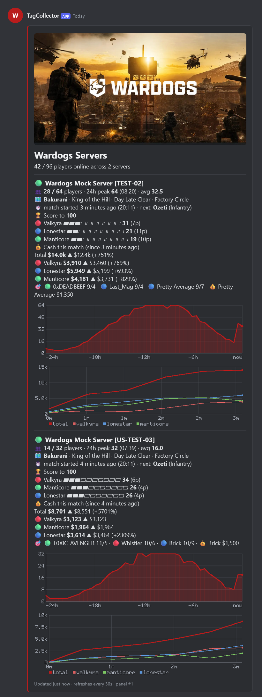
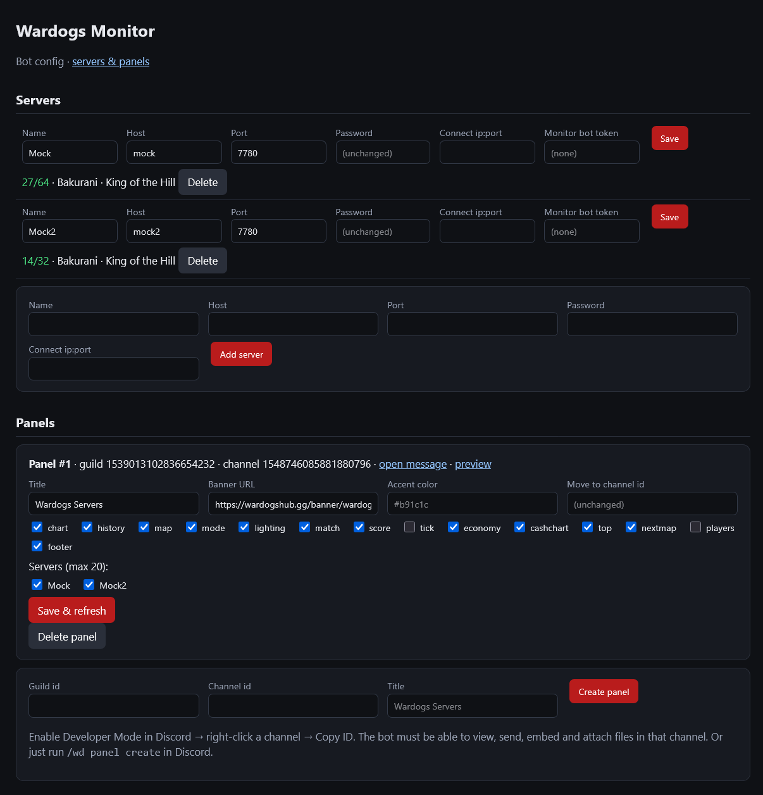

# Wardogs Monitor

> Live **Wardogs** server status in Discord — player count with a 24h graph, map, match timer, faction scores and economy, all in one self-updating panel.

<p align="center">
  
  
  
  
  
  
  
</p>

A Discord bot that polls your Wardogs game servers over the **RCON HTTP API** (the same one
<http://rcon.wardogs.com> uses) and keeps one or more **panel messages** up to date. Everything
is configured from Discord with `/wd …` slash commands — or through an optional web UI.
Multiple game servers, multiple panels, multiple channels and guilds, one bot.

The bot needs only *View Channels · Send Messages · Embed Links · Attach Files*. It posts the
panel once and edits it forever after; it never reads anyone's messages.

<p align="center">
  
</p>

## What a panel shows

Every section is a per-panel toggle (`/wd panel set`):

| | |
|---|---|
| 👥 **Players** | current / max, 24h **peak** (with time) and **average**, plus a **24h graph** rendered as an image |
| 🗺️ **Map** | map, game mode, lighting, zone alternator |
| ⏱️ **Match** | match start as a Discord relative timestamp, next map in rotation |
| 🏆 **Score** | faction scores with progress bars, players per faction; optional score-tick value |
| 💰 **Cash this match** | total and per-faction cash with ▲/▼ change since match start; optional cash-over-time image |
| 🎯 **Top** | top 3 by kills + richest player |
| 📋 **Players** | full roster grouped by team, sorted by kills, with K/D |
| 🎨 **Look** | title, banner image, accent colour, footer |

Panels that grow past Discord's per-message limits (4000 chars / 10 images) automatically
span several messages, so a status channel with a dozen servers just works.

Optional extras:

- **Connect button** per server (`steam://connect/…` via the web UI's redirect page).
- **Monitor bots** — an extra bot account per server whose nickname reads `🟢 42/64 · EU1`
  and whose status shows the map. Needs only *Change Nickname*.

## Quick start

### 1. Create the Discord application

1. <https://discord.com/developers/applications> → **New Application** → **Bot** → *Reset Token*.
   No privileged intents, no public key, no interactions URL needed.
2. Put the token into `.env` (see below). Optionally set `DISCORD_GUILD_ID` to your server's
   ID so `/wd` shows up instantly (global commands can take up to an hour).
3. Start the bot — it prints an **invite link** with exactly the permissions it needs
   (`bot` + `applications.commands`, permission bits `52224`). Open it, pick your server.

### 2. Run with Docker

```sh
cp .env.example .env          # fill in DISCORD_TOKEN (+ DISCORD_GUILD_ID)
docker compose up -d --build
docker compose logs -f bot
```

State (SQLite: servers, panels, 7 days of samples) lives in `./data/`. The container runs as
uid 1000; if Docker created `data/` as root on first start, fix it once with `sudo chown -R 1000:1000 data`.

### 3. Add a server and post a panel

```
/wd server add name:EU1 host:<rcon host> port:<rcon port> password:<rcon password>
/wd panel create
```

That's it. The panel updates every 30 s; the 24h graph fills in as samples accumulate.

### Try it without a game server

The `test2 / port 2` entry on rcon.wardogs.com is browser-side demo data (a mock client in the
page's JavaScript), not a network server. Use the bundled mock instead:

```sh
docker compose --profile mock up -d --build
```

```
/wd server add name:Mock  host:mock  port:7780 password:mock
/wd server add name:Mock2 host:mock2 port:7780 password:mock2
/wd panel create
docker compose exec bot node scripts/backfill.js Mock 24     # fake 24h of history
```

The mock drifts players in and out, ticks scores, moves cash around and rotates maps. It
implements every route the official web tool uses, so you can also point
**http://rcon.wardogs.com** at it (IP `127.0.0.1`, port `7780`, password `mock`) and use the
real admin UI against it — Chrome will ask for "local network access" permission the first time.

### Without Docker

Node ≥ 22.5 (uses the built-in `node:sqlite`; no native modules):

```sh
npm install
npm start          # the bot
npm run mock       # mock RCON server on :7780 (password "mock"), second terminal
```

## Commands

All `/wd` commands are limited to the **guild owner and members with Administrator** — enforced by
the bot itself, not just Discord's command permissions. Server (RCON) management is further limited
to `ADMIN_GUILD_IDS`; panels can be created in any guild the bot is in.

| Command | |
|---|---|
| `/wd server add name host port password [connect] [monitor_token]` | Add a game server. `connect` = game `ip:port` for the Connect link. |
| `/wd server list` | Servers with live state |
| `/wd server set server key value` | Change `name` `host` `port` `password` `connect` `monitor_token` |
| `/wd server test server` | Query now and show the raw numbers (credentials check) |
| `/wd server remove server` | Remove a server and its history |
| `/wd panel create [channel] [title] [servers]` | Post a new panel (default: this channel, all servers) |
| `/wd panel add` / `remove panel server` | Choose which servers a panel shows (max 20) |
| `/wd panel set panel key value` | Toggle sections, set title / banner / colour |
| `/wd panel move panel channel` | Re-post the panel elsewhere |
| `/wd panel list` · `delete` · `refresh` | |

### Panel options (`/wd panel set`)

| key | default | shows |
|---|---|---|
| `title` | Wardogs Servers | heading |
| `banner` | *(none)* | image URL on top |
| `color` | `#b91c1c` | accent bar + chart colour |
| `chart` | on | 24h player graph image |
| `history` | on | 24h peak / avg (text sparkline when `chart` is off) |
| `map` `mode` `lighting` | on | |
| `match` | on | match start time |
| `nextmap` | on | next rotation entry |
| `score` | on | faction scores |
| `tick` | off | raw score-tick value + min/max range |
| `economy` | on | cash this match: total + per faction, ▲/▼ since match start |
| `cashchart` | off | cash-over-time image for the current match |
| `top` | off | top 3 by kills + richest player |
| `players` | off | full roster by team |
| `footer` | on | "updated … · refreshes every 30 s" |

Example: `/wd panel set panel:1 key:cashchart value:on`

## Web UI (optional)

```
WEB_ENABLED=true
WEB_PASSWORD=something-long
```

Open `http://localhost:8080` (basic auth, user `admin`). The port is published on `127.0.0.1`
only; set `WEB_BIND=0.0.0.0` to reach it from your LAN. It is an admin tool — keep it off the
public internet (or behind a reverse proxy with its own auth). It mirrors the commands — add/edit
servers, toggle panel sections, pick servers per panel, move or create panels by
guild/channel ID — and has a **live preview** of each panel that renders the exact payload
the bot sends.

<p align="center">
  
</p>

Put it behind HTTPS and set `PUBLIC_URL=https://…` to get a **Connect** button on panels for
servers with a `connect` address (Discord can't link `steam://` directly, so the button goes
through `/connect/<id>`). Without `PUBLIC_URL` the address is shown as text.

## Monitor bots (optional)

Want the player count in the member list? Create one extra bot application per server,
invite it with **Change Nickname** only, then:

```
/wd server set server:EU1 key:monitor_token value:<token>
```

Its nickname becomes `🟢 42/64 · EU1`, its custom status the map + mode. Remove with
`value:none`.

## Configuration

| `.env` | default | |
|---|---|---|
| `DISCORD_TOKEN` | — | required |
| `DISCORD_GUILD_ID` | — | register commands in one guild (instant) |
| `ADMIN_GUILD_IDS` | = `DISCORD_GUILD_ID` | guilds allowed to add/edit servers (RCON passwords); panels work in any guild |
| `POLL_INTERVAL` | `30` | seconds between polls (min 10); one sample per poll |
| `HISTORY_DAYS` | `7` | sample retention |
| `RCON_TIMEOUT_MS` | `8000` | |
| `DEFAULT_BANNER_URL` `DEFAULT_COLOR` | | panel defaults |
| `WEB_ENABLED` `WEB_PORT` `WEB_USER` `WEB_PASSWORD` `PUBLIC_URL` | | web UI |
| `WEB_BIND` | `127.0.0.1` | host interface Docker publishes the web UI on (`0.0.0.0` = LAN) |
| `DATA_DIR` | `./data` | SQLite location |

## How it talks to the server

```
GET http://<host>:<port>/v1/status      Authorization: Bearer <rcon password>
GET /v1/players · /v1/rotation · /v1/catalog/maps · /v1/catalog/experiences
```

Plain HTTP JSON, read-only. If rcon.wardogs.com can reach your server, so can this bot.

## Notes

- RCON passwords are stored in plain text in `data/monitor.db` (the bot needs them to poll).
  Protect the `data/` folder.
- Servers are shared by all panels. Only guilds in `ADMIN_GUILD_IDS` (default: `DISCORD_GUILD_ID`)
  can add, edit or remove them; any guild the bot is in can create panels. All `/wd` commands
  require the guild owner or *Administrator*, checked at runtime.
- Charts are rendered in-process with a tiny PNG encoder — no native modules, no third-party
  chart services, nothing leaves your box except Discord API calls.
- If a panel message is deleted, the bot re-posts the panel on the next poll.
- Edits are skipped when nothing changed, but happen at least once a minute so the chart and
  "updated" footer stay fresh.

## Project layout

```
src/index.js     boot: poller + bot + optional web UI
src/rcon.js      Wardogs RCON HTTP client + normalisation
src/poller.js    polls all servers, stores samples, fans out to panels / monitors
src/panel.js     builds the Components-V2 message(s), packs servers into pages
src/chart.js     24h player chart, match cash chart, text sparkline
src/png.js       tiny RGBA canvas + PNG encoder + 5x7 font
src/bot.js       Discord client, post / edit / move panel messages
src/commands.js  /wd slash commands
src/monitor.js   optional nickname / status bots
src/web.js       optional admin UI, panel preview, /connect redirect
src/preview.js   renders a panel payload to HTML for the web UI
src/db.js        SQLite schema & queries (node:sqlite)
mock/server.js   fake Wardogs RCON API for testing
scripts/         backfill.js — fake history for a server
docs/            screenshots used in this README
```

## Credits

Built with [discord.js](https://discord.js.org/). Code written with AI assistance and reviewed
by a human.

## License

MIT — see [LICENSE](LICENSE).
